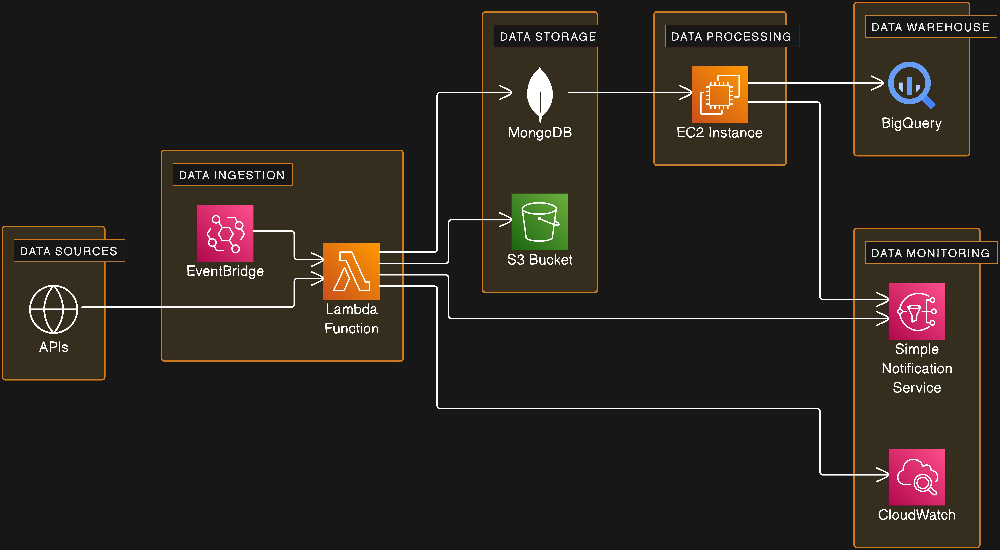
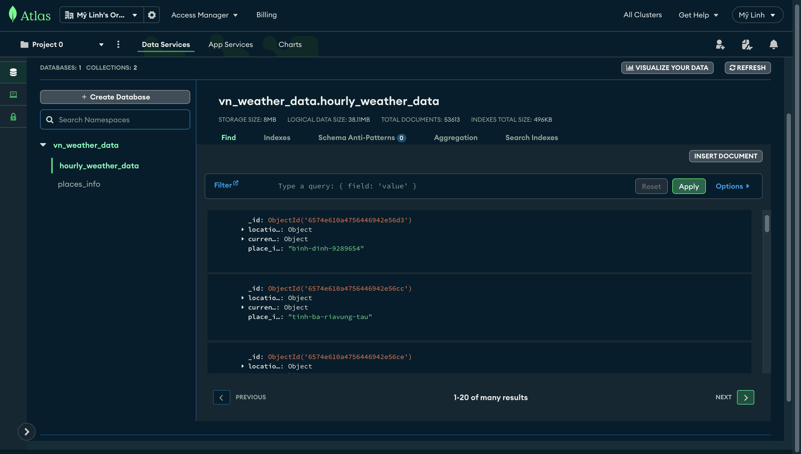
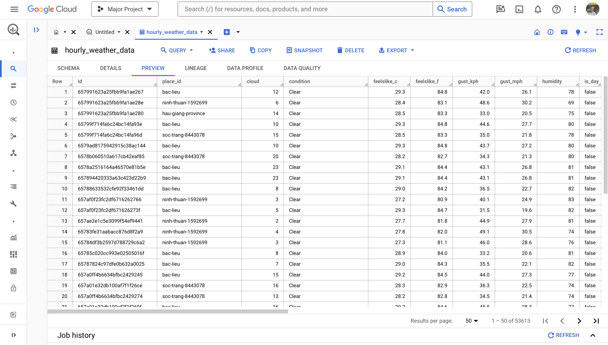

# Implementing a Data Lake Using MongoDB (Integrated with BigQuery)

## Description
This project is my major project at university. The full name of the project the professor gave me is "Learn About Data Lake and Implement It on MongoDB". This project is a group work. And I am the one who was responsible for the latter part - Implement data lake on MongoDB.

*Side story: I chose this topic because it is most related to my orientation and it seemed to be the most difficult topic among other ones to me. All other topics are quite familiar to me and I know what to do in every other topic. Therefore, I chose this - the data lake with MongoDB topic - to break myself out of my comfort zone where I would have chosen the easiser one.*

In the Implementing Data Lake on MongoDB part, I implemented a database which stores hourly weather data of 63 cities and provinces in Vietnam. The data is obtained via APIs and inserted into a collection in MongoDB automatically and hourly. Any data when inserted into MongoDB is processed to be structured and loaded into BigQuery. This is the architecture diagram of my data lake:

I developed a Python program which runs as a Lambda function on AWS to send request to API every hour. The data it gets from API then is checked. If the data meets the conditions, it is inserted into MongoDB. Otherwise, the program waits and request the data again. The program runs at the 10th minute every hour as that is the time the weather data of all 63 places have been successfully last updated at the 0th minute. And the program stop after 5 minutes because if it runs from the 15th minute, it may gets weather data last updated at the 15th minute. The trigger for the program is EventBridge. If there is any problem with the API or MongoDB connection, the program uses Simple Notification Service (SNS) to send an email to me. If the data the program gets can not be inserted into MongoDB successfully, the program load the data into an S3 bucket, and it also sends me an email about that issue. The activities of the program are logged and saved on AWS thanks to CloudWatch. 

Another Python program is deployed on an EC2 instance to detect data changes in the collection storing hourly weather data. If there is new data inserted into the collection, the program processes the data and check if this data is already in BigQuery. If it is not, it is inserted into BigQuery. Because BigQuery now does not support primary key, foreign key, and unique constraint, so that I have to check the data to ensure the integrity as well as the quality of the data I store. Data updated in the collection is also processed, checked and updated in BigQuery. The data deletion in the collection does not make its equivalent data in BigQuery to be deleted as the deletion in the collection here only serves as space cleaning. The deployed Python program on the EC2 instance is triggered by a Shell program. The Shell program is executed to make to Python program run. If the Python program exits with unhandled error, the Shell program use SNS to send me an email about the issue and it also exits. 

I spent so much time for error handling for this project. However, after more than 1 month of deployment, there is 0 error :D They all run perfectly well.

Side story: I am aware that although this is a major project, it is small. It is not applicable, usable nor realistic. And I struggled so much because of this thought. My major is Managment Information Systems. At the time I did this project, I am in my 4th year. However, I have been in this major for just 2 years as I made a major change from marketing. My major does not focus on all the things I learned by myself to make this project. I did have to learn so much. And I did apply so much from what I learned. That is what matters. It is not applicable, usable nor realistic - I know that but what I learned from this project matters more. Not the data lake, Python, Bash, AWS, GCP, MongoDB knowledge that makes me content but how proud I feel of myself that does. I am no longer a shy girl who was afraid that she was "behind" many people, that she was not "enough", and that her abilities are doutful.
> I can do anything now. And choosing to do risky things is now my favourite choice. Those are the big lessons to me - the lessons that anyone can know but not everyone can learn.

I got an A for this project (A is the highest grade in my university, equivalent to 4.0) :D

# Deployment

To re-deploy this project, it takes so much work as there are many keys needed. There are 2 main programs you need deploy: (1) ingest_weather_data.py, (2) process_insert_update_weather_data.py.

## Deploy ingest_weather_data.py

1. Clone this repo

2. Fill in those variables in .env file (Account, datasebase, collection, topic, key, and bucket creation may be needed):
- MONGO_CONNECTION_STRING: Your MongoDB cluster connection string
- MONGO_DB_NAME: Your MongoDB name
- MONGO_PLACES_COLLECTION_NAME: The name of the collection which stores descriptive data about 63 places
- MONGO_WEATHER_COLLECTION_NAME: The name of the collection which stores hourly weather data of those 63 places
- PLACES_API_KEY: Your API key to get descriptive data about 63 places. Get it at: [API](https://rapidapi.com/MeteosourceWeather/api/ai-weather-by-meteosource). Remember to choose the **find_places** endpoint.
- WEATHER_API_KEY: Your API key to get hourly weather data. Get it at: [API](https://rapidapi.com/weatherapi/api/weatherapi-com). Remember to choose the **Realtime Weather API** endpoint.
- INGESTION_TOPIC_ARN: Create a topic on AWS SNS and paste the ARN of that topic here
- AWS_ACCESS_KEY: Create an access key on AWS and paste its access key here
- AWS_SECRET_ACCESS_KEY: Paste the sescret access key of the same access above here
- REGION_NAME: The region name which you choose to use
- BUCKET_NAME: Create an S3 bucket and paste its name here

3. Install dependencies using `pip install -r requirements.txt`

*The descriptive data of the 63 places is neccessary because the coordinates in it is used as parameters for the **ingest_weather_data.py** to use to make API requests. The **ingest_places_data.py** is excuted to get and inserted descriptive data into a MongoDB collection. Then the **extract_coordinates.py** is executed to extract the coordinates to a JSON file (**place_coordinates.json**) for the **ingest_weather_data.py** to use.*

4. Run `./ingest_places_data.py`

5. Run `./extract_coordinates.py`

6. Move **place_coordinates.json**, **.env**, and **ingest_weather_data.py** into a directory

7. Change current working directory to that directory

8. Download the unstandard Python libraries into that directory using `pip install requests pymongo boto3 python-dotenv fuzzywuzzy python-Levenshtein -t .`

9. Zip all files in that directory using `“zip -r ingest_weather_data.zip .`

10. Create a Lambda function on AWS

11. Change the **Handler** in the **Runtime Settings** of the function to **ingest_weather_data.handler**

12. Change the **timeout** in **Configuration > General configuration** to **5 minutes**

13. Add a trigger using EventBridge

14. Use **cron(10 * * * ? *)** as the cron expression for the trigger

15. Check if the **Rule state** of the trigger is **ENABLED** in **Configuration > Triggers** and you're done

## Deploy process_insert_update_weather_data.py

1. Fill in those variables in .env file (Account, project, dataset, table, topic, key creation may be needed):
BIGQUERY_DATASET_ID: The dataset name
BIGQUERY_PLACES_TABLE_ID: The name of the table which stores descriptive data of 63 places
BIGQUERY_WEATHER_TABLE_ID: The name of the table which stores hourly weather data of 63 places
GCP_SERVICE_ACCOUNT_KEY_FILE_NAME: The JSON file name you download after creating a key on GCP
TRANSFER_TOPIC_ARN: The ARN of another topic on AWS SNS

2. Run this on your local machine to insert descriptive data of 63 places to BigQuery `./process_insert_places_data.py`

3. Connect to your EC2 instance (mine uses Amazon Linux)

4. Install pip3 by running `python3 -m ensurepip --default-pip`

5. Use pip3 to install neccessary unstandard Python libraries `pip3 install pymongo google-cloud-bigquery`

6. Configure AWS CLI on the instance by running `aws configure`

7. Paste your **AWS_ACCESS_KEY**, **AWS_SECRET_ACCESS_KEY**, **REGION_NAME** into the terminal (I skip file format as its default format - JSON - is ok)

8. Run the commands below to create a directory and its sub-directories to store source code files and necessary data files
`mkdir process_insert_update_weather_data`
`cd process_insert_update_weather_data`
`mkdir data`
`mkdir log`
`mkdir src`

9. Copy, paste and save the GCP service account key file content in the **data** directory
`cd data`
`nano [your file name]`
**Paste the content**
<kbd>CTRL + X</kbd>
<kbd>Y</kbd>
<kbd>ENTER</kbd>

10. Do so with the **.env**, **monitor.sh**, and **process_insert_update_weather_data.py** files in the **src** directory

11. Grant execution permission for **monitor.sh** by running `chmod +x monitor.sh`

12. Run the Shell program `nohup ./monitor.sh > /dev/null &`

13. Check if **monitor.sh** and **process_insert_update_weather_data.py** are running by running this command `ps aux | grep -e monitor.sh -e process_insert_update_weather_data.py`

# The data in my data lake

This is the hourly weather data in MongoDB at the time I write this README.md file:

And this is the hourly weather data in BigQuery:

The collection in MongoDB contains 53.613 documents - equivalent to 53.613 rows in the table in BigQuery. That means all the data inserted into the collection in MongoDB is captured and processed, loaded into BigQuery. There is no email about error since I officially deployed the programs and the data the programs handle is pretty good. You can contact to get this data though I don't know who will need this :D

There are many things need to be improved in this project, or perhaps, in my future projects which will be more "usable". I would love to hear any idea you come up with for this project. Happy learning!
